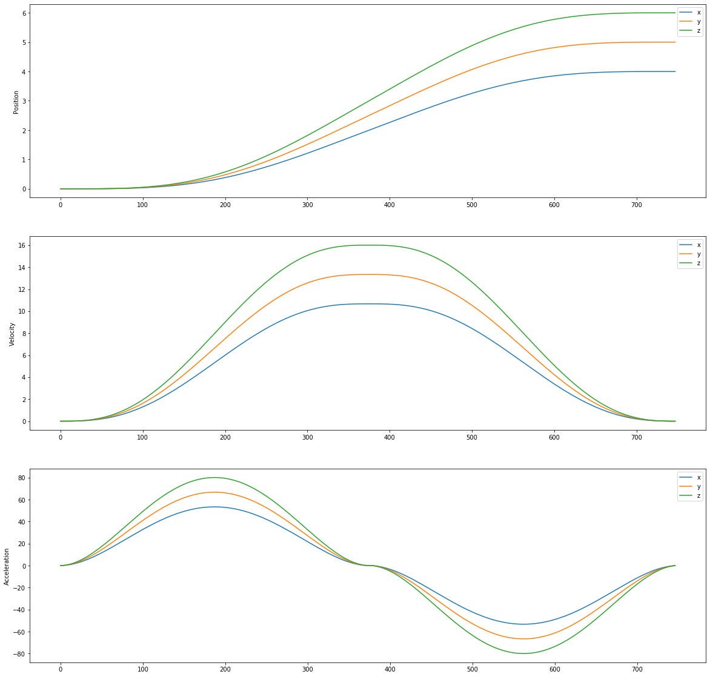
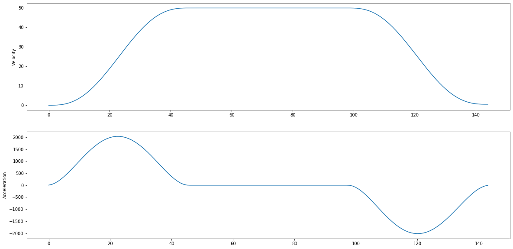
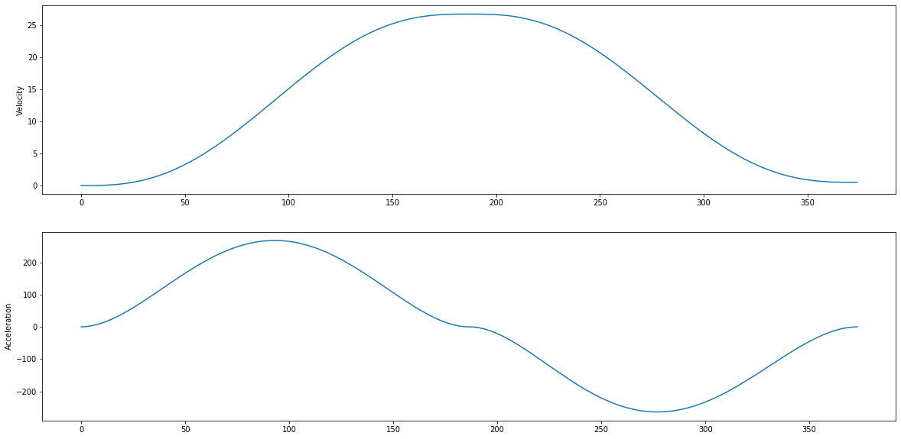

# MotionLib
## A templated C++ library which generates coördinated motion.

## Features
- N-th dimensional: (e.g.) 3 dimensions for cartesian x, y, z motion or 4 dimensions for x, y, z, e motion for FDM printers.
- 6-th order velocity profiles: utilizing the 6-th order polynomial function to generate smooth velocity profiles.
- Acceleration constrained: Planner will not sur pase the specified maximum acceleration.
- Velocity constrained: Planner will not sur pase the specified maximum velocity.
- Timed: All dimensions are coordinated.

## Dependencies
- C++14 STL

## Summary
This small motion library can generate velocity and positional profiles based on user specifications like dimension count, maximum acceleration, target velocity. 
The motivation of this library is that there are a few possible alternatives which involve a deeper understanding of mathematics. This library is user friendly and easy to implements.

## Example Implementation
In this example a 6 dimensional Motion object is created. The planner gets a position of {1, 2, 3, 4, 5, 6}. 

```C++
#include <iostream>

// Only include Motion.hpp
#include "../Motion/Motion.hpp"

int main() {
	// Class Motion takes two template arguments: first is type (float, double, int etc.), 
	// second is number of dimensions.
	// The object takes one argument: hz, which is the amount of samples created per second (or resolution).
	Motion<double, 6> motion(10000);

	// set_position takes array which represents desired position.
	// Positions are always absolute.
	std::array<double, 6> p{ 1, 2, 3, 4, 5, 6 };

	// Orientation and position are given in three dimensions.
	// The motion class will calculate for the 6 dimensions.


	// Plan the motion. The paramters are velocity acceleration and final velocity respectively.
	motion.plan_motion(p, 500, 2000, 0);
	motion.plan_motion(p, 500, 2000, 0);

	std::cout << "roll, pitch, yaw, x, y, z" << "\n";

	bool motion_state = true;
	while (motion_state) {
		// Get velocity setpoints of current time sample.
		auto result = motion.get_velocity_setpoint();

		// Increment motion.
		// Return false when all motion samples are returned.
		motion_state = motion.increment_motion_sample();

		std::cout << result[0] << ", "
			<< result[1] << ", "
			<< result[2] << ", "
			<< result[3] << ", "
			<< result[4] << ", "
			<< result[5] << "\n";

	}

	return 0;
}
```
This will result in the following profiles:



## How it works
The planner uses three points (0,1,2) to calculate the angle on the second point. This is important to know as the planner can adept entrance and exit velocities based on the "sharpness" of the corner. A ratio is calculated and used to calculate the exit velocity of the motion between point 0 and 1. 

After the ratio is determined with its exit velocities, the planner will determine wether the motion can reach the maximum velocity with the maximum acceleration (fastest motion). Two different scenarios are possible: the motion can reach max velocity and the motion cannot reach the max velocity. In the first case a acceleration, coast and deceleration phase is calculated.

The image below demonstrates the acceleration, coasting and deceleration of the motion.
```C++
// 1 dimensional position is 5.
std::array<double, 1> p {5};
// Max velocity is 50, max accel is 2000.
motion.set_position(p, 50, 2000);
```


The second case requires some extra calculations to determine the correct acceleration and velocity to reach the specified position. The maximum velocity and acceleration are only constraints, not specifications which have to be met. The only specification is the position. The image below demonstrates a transitional motion where the velocity does not reach its maximum.
```C++
// 1 dimensional position is 5.
std::array<double, 1> p {5};
// Max velocity is 50, max accel is 500.
motion.set_position(p, 50, 500);
```


Under Motion/Config.hpp some macros are defined which can be used to change the motion behavior.

The motion planner has a dimensionless setup, meaning that the inputs and resulting trajectories do not hold a context by definition (like [mm/s] or [rad/s]). The user of this library can define what the proper units would be based on the context of the application.