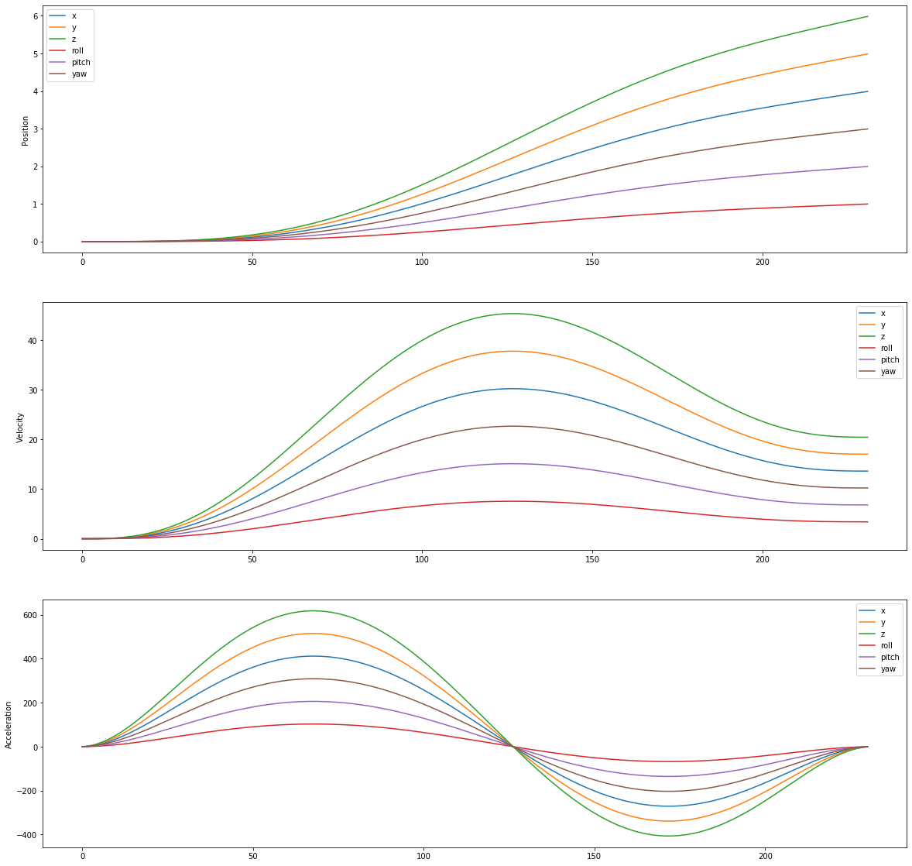

# MotionLib
## A templated C++ library which generates coördinated motion.

## Features
- N-th dimensional: (e.g.) 3 dimensions for carthesian x, y, z motion or 4 dimensions for x, y, z, e motion for FDM printers.
- 6-th order velocity profiles: utilizing the 6-th order polynomial function to generate smooth velocity profiles.
- Acceleration contrained: Planner will not surpase the specified maximum acceleration.
- Timed: All dimensions are coordinated.
- High precision: Up to 3 micron precision.

## Dependancies
- C++14 STL

## Summary
This small motion library can generate velocity and positional profiles based on user specifications like dimension count, maximum acceleration, target velocity. 
The motivation of this library is that there are a few possible alternatives which involve a deeper undertanding of mathematics. This library is user friendly and easy to implements.

## Example Implementaion
In this example a 3 dimensional Motion object is created. The planner gets a position of {4, 5, 6}. 

```C++
#include <iostream>

// Only include Motion.hpp
#include "../Motion/Motion.hpp"

int main () {
    // Class Motion takes two template arguments: first is type (float, double, int etc.), 
    // second is number of dimensions.
    Motion<double, 3> motion(1000);

    // set_position takes array which represents desired position.
    // Positions are always absolute.
    std::array<double, 3> p {4, 5, 6};

    // Give desired position with velocity target and max acceleration.
    motion.set_position(p, 100, 500);

    for (int i = 0; i < 625; i++) {
        // Return motion monotonically.
        auto result = motion.get_next_velocity_setpoint();
        std::cout   << result[0] << ", " 
                    << result[1] << ", " 
                    << result[2] << "\n";
    }
    
    return 0;
}
```
This will result in the following profiles:



## How it works
The planner uses three points (0,1,2) to calculate the angle on the second point. This is important to know as the planner can addept entrance and exit velocities based on the "sharpness" of the corner. A ratio is calculated and used to calculate the exit velocity of the motion between point 0 and 1. 

After the ratio is determined with its exit velocities, the planner will determine wether the motion can reach the maximum velocity with the maximum acceleration (fastest motion). Two different scenrios are possible: the motion can reach max velocity and the motion cannot reach the max velocity. In the first case a acceleration, coast and desceleration phase is calculated.

The image below demonstrates the acceleration, coasting and desceleration of the motion 
```C++
// 1 dimensional position is 5.
std::array<double, 1> p {5};
// Max velocity is 50, max accel is 2000.
motion.set_position(p, 50, 2000);
```


The second case requires some extra calculations to determine the correct acceleration and velocity to reach the specified position. The maximum velocity and acceleration are only constraints, not specifications which have to be met. The only specification is the position. The image below demonstrates a transitional motion where the velocity does not reach its maximum.
```C++
// 1 dimensional position is 5.
std::array<double, 1> p {5};
// Max velocity is 50, max accel is 500.
motion.set_position(p, 50, 500);
```


Under Motion/Config.hpp some macros are defined which can be used to change the motion behaviour.

The motion planner has a dimensionless setup, meaning that the inputs and resulting trajectories do not hold a context by definition (like [mm/s] or [rad/s]). The user of this library can define what the proper units would be based on the context of the application.

## TODO
- Implement jerk constaints.
- STL independant for embedded applications (unique branch).
- Kinematics for advanced use-cases.
- Implement relative positioning.
- Add user defined final velocity condition.